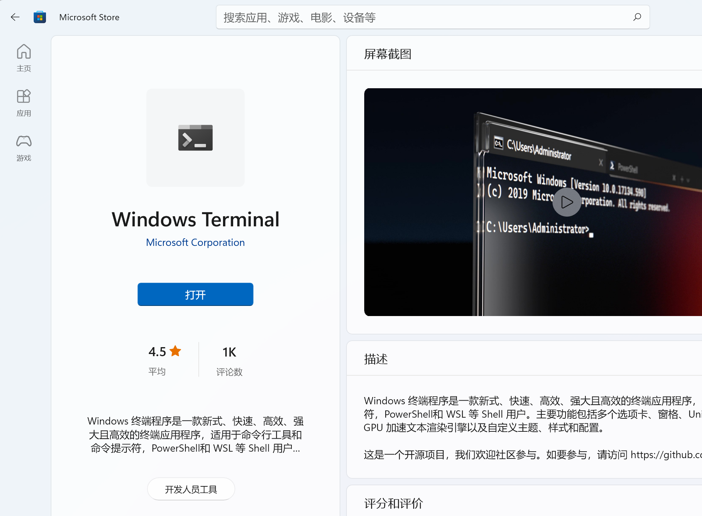
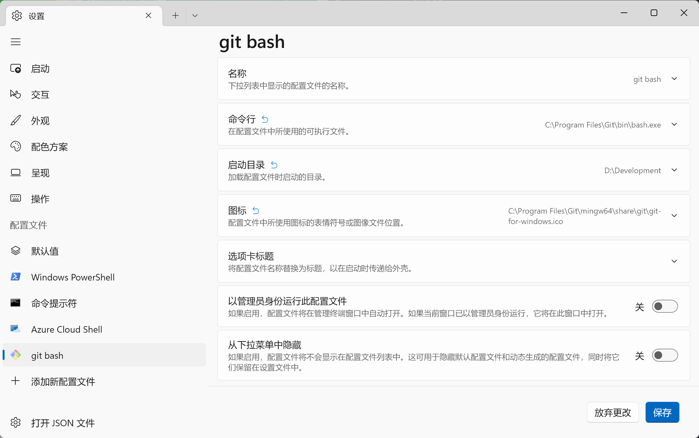
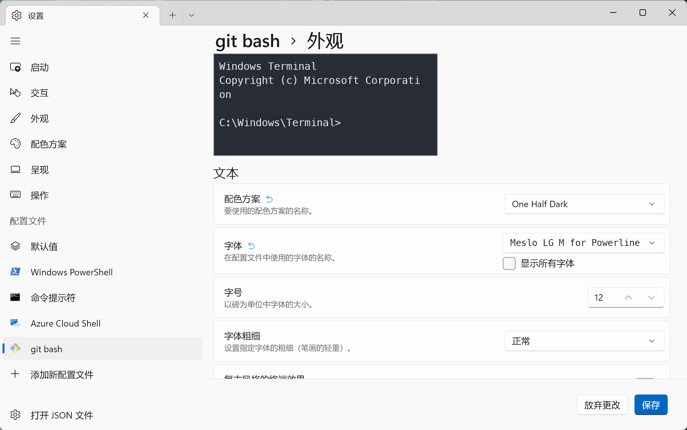
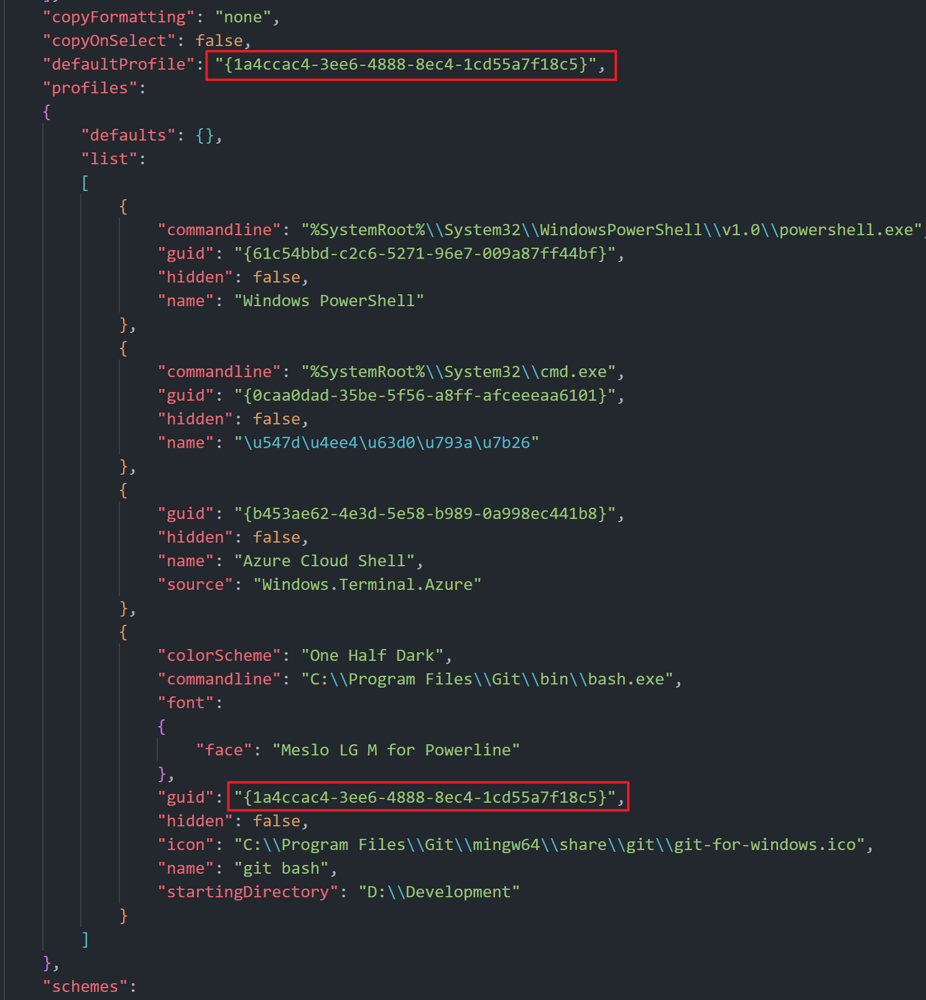
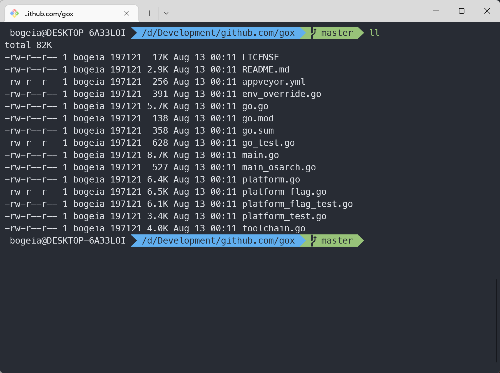

# 我喜欢的软件

`Windows Terminal` + `git-bash` + `zsh` + `oh-my-zsh`

### 0x01 Install `git` 
```http request
https://git-scm.com/download/win
```

### 0x02 Install `zsh`
```http request
https://packages.msys2.org/package/zsh?repo=msys&variant=x86_64
```
> 1. 将下载的文件解压到 `Git` 的安装目录下，可以简单理解成把 `zsh` 当做 `git bash` 的一个补充安装包
> 2. 打开 `git bash`, 输入 `zsh --version` 检测是否安装成功。


### 0x03 Install `oh my zsh`
```shell
sh -c "$(curl -fsSL https://raw.github.com/ohmyzsh/ohmyzsh/master/tools/install.sh)"
```
> 1. oh my zsh 相关文件存储在 `~/.oh-my-zsh` 目录下
> 2. `~` 的目录为 `C:\Users\<your username>`
> 3. 可以通过编辑 `~/.zshrc` 文件中的 `ZSH_THEME="robbyrussel"` 更换主题
> 4. 很多主题需要先安装 [powerline](https://github.com/powerline/fonts) 才能正常的渲染成功

####  安装常见插件

`zsh-autosuggestions` 自动补全
```shell
git clone https://github.com/zsh-users/zsh-autosuggestions ${ZSH_CUSTOM:-~/.oh-my-zsh/custom}/plugins/zsh-autosuggestions
```

`zsh-syntax-highlighting` 语法高亮
```shell
git clone https://github.com/zsh-users/zsh-syntax-highlighting.git ${ZSH_CUSTOM:-~/.oh-my-zsh/custom}/plugins/zsh-syntax-highlighting
```
然后编辑 `~/.zshrc`，加入插件(空格 或者空行作为分割符号)
> plugins=(git zsh-autosuggestions zsh-syntax-highlighting)

### 0x04 设置 `zsh` 为 `bash` 默认终端

> 编辑 `~/.bashrc`，或者是 `C:\Program Files\Git\etc\bash.bashrc`，加入下面的几行。

```bash
# Launch Zsh
if [ -t 1 ]; then
exec zsh
fi
```

### 0x05 Install `Windows Terminal`

在 `Microsoft Store` 里安装 `Windows Terminal`



### 0x06 Install `Windows Terminal` 默认使用 `git bash`



根据个人需要，选择喜欢的配色方案和字体


打开左下角 `打开JSON文件`，修改 `defaultProfile`的值


本人使用的主题是 `ZSH_THEME="agnoster"` 需要下载字体 `Meslo LG M for Powerline`，否则图标会显示异常

最终效果图如下所示：
